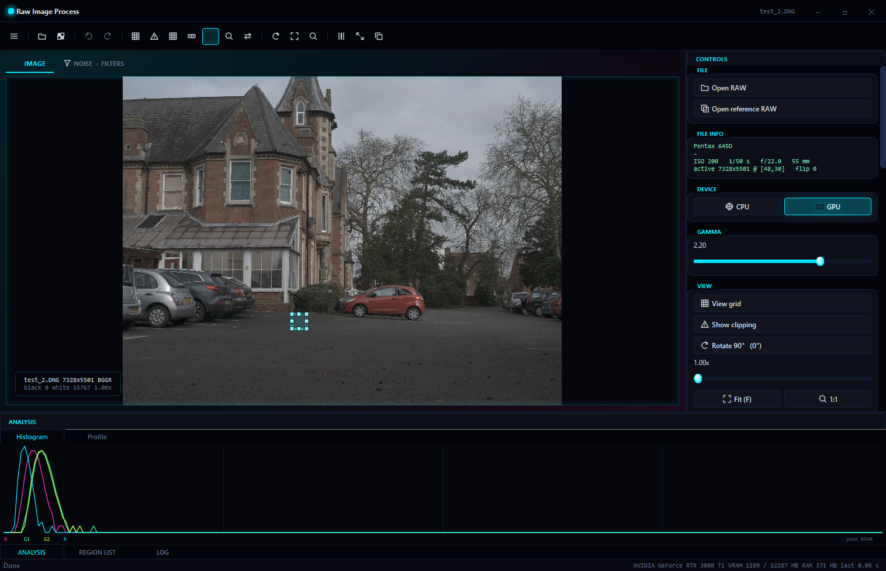

# Raw Image Process

Приложение для Windows, которое открывает RAW-файлы камер, измеряет шум сенсора, подавляет его прямо в мозаике Байера и восстанавливает цвет тремя методами демозаика: на процессоре или на видеокарте NVIDIA через CUDA.



## Возможности

- **Чтение RAW через LibRaw**: активная область сенсора, уровни black и white, баланс белого камеры, EXIF, зона optical black.
- **Статистика любой области** отдельно по каналам R, G1, G2, B: среднее, σ, минимум, максимум, гистограмма и профиль.
- **Анализ шума**: гистограммы «до / после», SNR в dB, двухкадровый метод (временной шум и фиксированный узор), вычитание темнового кадра, измерение уровня чёрного.
- **Шумоподавление в мозаике**: Gaussian, Median 3×3 / 5×5, Bilateral. Каждый CFA-канал фильтруется отдельно, цвета не смешиваются, всё отменяется через <kbd>Ctrl</kbd>+<kbd>Z</kbd>.
- **Демозаик**: Binning 2×2, Bilinear, Malvar-He-Cutler на CPU (все ядра) и на GPU (CUDA).
- **Экспорт**: RAW в `.bin` и 16-битный TIFF, результат в PNG и линейный 16-битный TIFF, статистика в CSV, пресеты в JSON.
- **Работает без видеокарты**: если CUDA-устройства нет, всё считается на процессоре.

## Установка

1. Скачай `RawImageProcess-1.0-Setup.exe` со страницы **Releases** этого репозитория.
2. Запусти установщик. Если Windows покажет «Windows защитила ваш компьютер», нажми **Подробнее → Выполнить в любом случае**: у установщика нет платной цифровой подписи.
3. Открой **Raw Image Process** из меню Пуск.

**Требования:** Windows 10 версии 1809 или новее либо Windows 11, 64-бит; от 8 ГБ ОЗУ. Видеокарта NVIDIA не обязательна.

## Быстрый старт

1. <kbd>Ctrl</kbd>+<kbd>O</kbd> — открыть RAW. Файл можно просто перетащить в окно.
2. Протяни мышью прямоугольник по ровному однотонному участку: справа появится статистика, внизу гистограмма.
3. <kbd>Ctrl</kbd>+<kbd>2</kbd> — вкладка шума: σ, SNR и гистограммы по каналам.
4. Выбери фильтр и нажми **Apply**, затем сравни кривые «до» и «после». <kbd>Ctrl</kbd>+<kbd>Z</kbd> отменяет фильтр.
5. <kbd>Ctrl</kbd>+<kbd>1</kbd>, метод **Malvar**, <kbd>Ctrl</kbd>+<kbd>D</kbd> — цветная картинка. <kbd>Ctrl</kbd>+<kbd>S</kbd> сохраняет PNG.

## Документация

| Раздел | О чём |
|---|---|
| [Интерфейс](docs/interface.md) | каждое меню, кнопка, панель и горячая клавиша; типичные сценарии работы |
| [Шум](docs/noise.md) | откуда берётся шум RAW, как программа его измеряет, как устроены фильтры |
| [Восстановление цвета](docs/color.md) | мозаика Байера, три метода демозаика, гамма, форматы файлов |
| [Справочник функций](docs/api.md) | все функции библиотеки с параметрами и примерами кода |
| [Сборка и GitHub](docs/build-and-github.md) | сборка из исходников, установщик, публикация и установка на другой ПК |

## Структура проекта

| Файл | Что внутри |
|---|---|
| `gui.cpp` | приложение с окном на Qt 6 |
| `im_read.hpp` | загрузка RAW, демозаик на CPU, сохранение файлов, гамма |
| `image_stats.hpp` | статистика, гистограммы, профиль, двухкадровый шум, темновой кадр |
| `denoise.hpp` | фильтры шумоподавления по CFA-каналам |
| `process.hpp` | выбор устройства (CPU/GPU) и метода демозаика |
| `gpu_process.hpp` | CUDA: память, запуск ядер, информация об устройстве |
| `im_process.cu`, `im_process.cuh` | CUDA-ядра демозаика и гаммы |
| `main.cpp` | консольная программа для быстрой проверки файла |
| `installer/` | скрипт сборки установщика и сценарий Inno Setup |
| `docs/` | документация, скриншоты и примеры кода |

## Сборка

Полная инструкция — в [docs/build-and-github.md](docs/build-and-github.md). Готовую программу и установщик собирает одна команда:

```powershell
powershell -ExecutionPolicy Bypass -File installer\build_installer.ps1
```

Скрипт собирает Release, складывает программу в `dist\RawImageProcess`, делает portable-zip и, если установлен Inno Setup 6, `dist\RawImageProcess-1.0-Setup.exe`.
