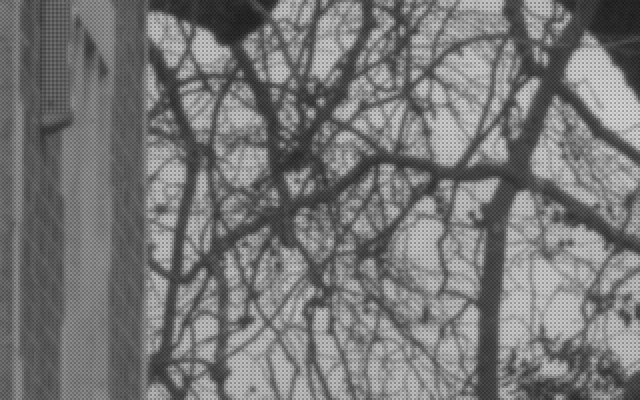
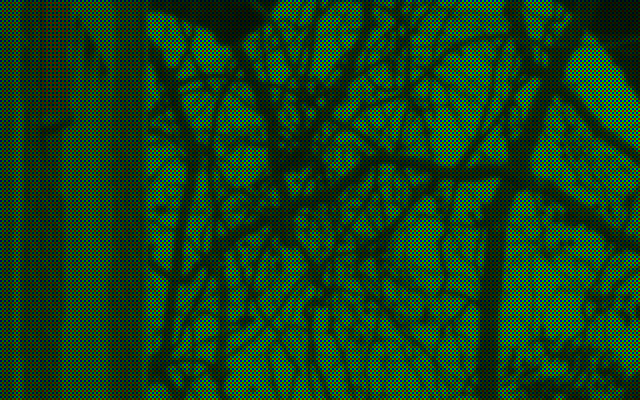
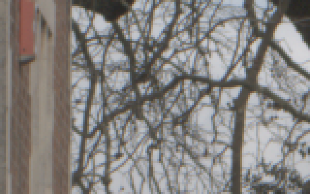
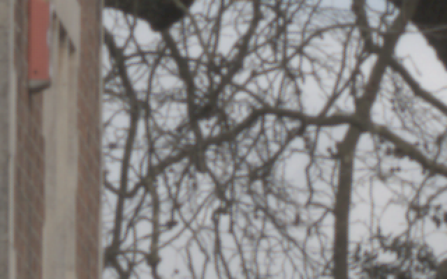
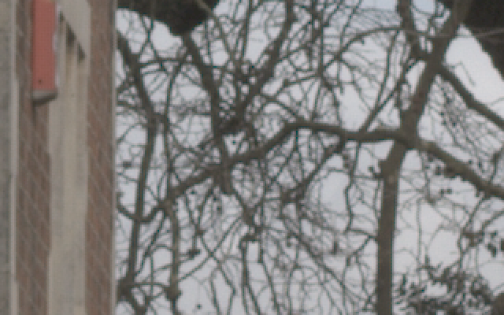

# Восстановление цвета

Сенсор камеры не видит цвет. Над каждым пикселем стоит цветной фильтр, и пиксель измеряет яркость только одного цвета: красного, зелёного или синего. Восстановить полноценный цвет в каждой точке — задача **демозаика** (demosaicing). В программе три метода: Binning 2×2, Bilinear и Malvar-He-Cutler.

## Мозаика Байера

Фильтры повторяются блоком 2×2: один красный, один синий и два зелёных. Зелёных вдвое больше, потому что глаз сильнее всего чувствителен к зелёному, и именно зелёный канал несёт основную резкость.





У разных камер блок начинается с разного цвета. Программа определяет узор автоматически и показывает его в строке состояния и в HUD:

| Узор | Верхний ряд | Нижний ряд | Пример |
|---|---|---|---|
| `RGGB` | R G | G B | iPhone 8, `test.dng` |
| `BGGR` | B G | G R | Pentax 645D, `test_2.DNG` |
| `GRBG` | G R | B G | — |
| `GBRG` | G B | R G | — |

### Как узор хранится в коде

LibRaw отдаёт узор 32-битным числом `filters` (в программе `RawImage::cfaPattern`). На каждую позицию отведено 2 бита: `0` — красный, `1` — зелёный, `2` — синий, `3` — второй зелёный. Цвет пикселя `(x, y)` вычисляет `RawImage::color_at`:

```cpp
int color_at(int x, int y) const {
    return (cfaPattern >> ((((y << 1) & 14) | (x & 1)) << 1)) & 3;
}
```

Для `test.dng` это `0xb4b4b4b4` (RGGB), для `test_2.DNG` — `0x1e1e1e1e` (BGGR). Функция `cfa_index(x, y) = ((y & 1) << 1) | (x & 1)` нумерует позиции внутри блока 2×2 числами 0…3. По этим номерам вся статистика и фильтры разделяют пиксели на каналы R, G1, G2, B.

## Подготовка значений

Все три метода начинают одинаково.

1. **Нормировка.** Значение сенсора переводится в диапазон 0…1:

   ```text
   v = (raw − black_level) / (white_level − black_level)
   ```

   `black_level` — уровень, который сенсор выдаёт в полной темноте, `white_level` — уровень насыщения. У `test.dng` это 528 и 4095, у `test_2.DNG` — 0 и 15767.

2. **Баланс белого.** Красный и синий умножаются на коэффициенты камеры из файла (`cam_mul`), поделённые на зелёный. У `test.dng`: R × 1.552, B × 2.841. У `test_2.DNG`: R × 1.855, B × 1.258. После этого серое в сцене становится серым на картинке.

3. **Ограничение и 8 бит.** Результат обрезается в 0…1 и умножается на 255.

> [!NOTE]
> Программа не применяет цветовую матрицу камеры (перевод из «RGB камеры» в sRGB) и не восстанавливает пересвеченные участки. Цвета получаются правдоподобными, но не колориметрически точными. Для анализа шума это не важно: статистика и фильтры работают с исходными RAW-значениями.

## Binning 2×2

Самый простой метод. Каждый блок 2×2 превращается в **один** пиксель:

```text
R = значение красного пикселя блока
B = значение синего пикселя блока
G = (G1 + G2) / 2
```

Картинка получается **вдвое меньше по каждой стороне**, зато в каждой точке все три цвета измерены, а не придуманы. Усреднение двух зелёных ещё и немного снижает шум зелёного канала.



## Bilinear

Полный размер: недостающие цвета в каждом пикселе берутся **средним ближайших соседей** того же цвета.

| Где стоит пиксель | Зелёный | Красный / синий |
|---|---|---|
| красный или синий фильтр | среднее 4 соседей по горизонтали и вертикали | недостающий цвет — среднее 4 соседей по диагонали |
| зелёный фильтр | своё значение | цвет соседей в строке — среднее левого и правого, цвет соседей в столбце — среднее верхнего и нижнего |

Какой из двух цветов лежит в строке, программа узнаёт по цвету левого соседа (`color_at(x − 1, y)`).



## Malvar-He-Cutler

Метод из статьи Malvar, He, Cutler (Microsoft Research, 2004). Он тоже линейный, но добавляет **поправку по градиенту**: смотрит, как меняется яркость в самом пикселе и на расстоянии двух пикселей, и корректирует интерполяцию. Края получаются резче, цветных ореолов меньше, а считается почти так же быстро, как Bilinear.

Каждое значение — взвешенная сумма окна 5×5, делённая на 8. Обозначения: `v` — пиксель в центре, `Σорт` — сумма 4 соседей по горизонтали и вертикали, `Σдиаг` — 4 соседей по диагонали, `Σдаль` — 4 пикселей на расстоянии 2.

**Зелёный в красном или синем пикселе:**

```text
G = (4·v + 2·Σорт − Σдаль) / 8

   0   0  −1   0   0
   0   0   2   0   0
  −1   2   4   2  −1      × 1/8
   0   0   2   0   0
   0   0  −1   0   0
```

**Синий в красном пикселе (и красный в синем):**

```text
C = (6·v + 2·Σдиаг − 1.5·Σдаль) / 8

    0     0   −1.5    0     0
    0     2    0      2     0
  −1.5    0    6      0   −1.5     × 1/8
    0     2    0      2     0
    0     0   −1.5    0     0
```

**Цвет соседей по строке в зелёном пикселе:**

```text
C = (5·v + 4·Σгор − Σдиаг − Σдаль_гор + 0.5·Σдаль_верт) / 8

   0    0   0.5   0    0
   0   −1   0    −1    0
  −1    4   5     4   −1      × 1/8
   0   −1   0    −1    0
   0    0   0.5   0    0
```

Для цвета соседей по столбцу берётся та же маска, повёрнутая на 90°.



**Края кадра.** Когда окну не хватает пикселей у границы, `raw_at` подставляет ближайший пиксель внутри кадра. Поэтому по краям нет чёрной рамки.

## CPU и GPU

| | CPU | GPU (CUDA) |
|---|---|---|
| Где считается | `demosaic_cpu_progress`, `demosaic_full_progress` | ядра `demosaicBinKernel`, `demosaicFullKernel` |
| Параллельность | строки делятся на полосы, каждая полоса в своём потоке (`std::async`); потоков — по числу ядер, но не больше чем по одному на 64 строки | каждый пиксель — отдельный поток GPU, блоки 16×16 |
| Прогресс и отмена | главный поток раз в 2 мс спрашивает `report`; если тот вернул `false`, работа останавливается | кадр считается полосами: 256 строк для Binning, 512 для полного размера; после каждой полосы — `report` |
| Данные | в памяти процесса | загружаются в видеопамять один раз, результат скачивается в конце |

## Гамма

Линейные значения сенсора выглядят тёмными, потому что глаз воспринимает яркость нелинейно. После демозаика программа применяет гамму:

```text
out = 255 · (in / 255)^(1/γ),  по умолчанию γ = 2.2
```

Гамма меняет только вид цветной картинки и PNG; RAW-данные, статистику и фильтры она не трогает. На CPU гамма считается в одном потоке (`apply_gamma`), на GPU — ядром `applyGammaKernel` по 256 потоков в блоке.

## Сравнение методов

Замеры `docs/examples/demosaic_benchmark.cpp`, Release-сборка. Время включает демозаик и гамму. Процессор AMD Ryzen 5 7500F (12 потоков), видеокарта NVIDIA GeForce RTX 3080 Ti.

| Метод | Размер | `test.dng` 4032×3024, CPU | GPU | `test_2.DNG` 7328×5501, CPU | GPU |
|---|---|---|---|---|---|
| Binning 2×2 | ½ × ½ | 77.9 мс | 7.5 мс | 254.2 мс | 21.2 мс |
| Bilinear | полный | 312.5 мс | 17.3 мс | 1012.8 мс | 56.4 мс |
| Malvar-He-Cutler | полный | 317.1 мс | 17.6 мс | 1038.5 мс | 60.3 мс |

Сам демозаик на CPU без гаммы идёт намного быстрее: 6 / 20 / 34 мс для `test.dng` и 17 / 64 / 88 мс для `test_2.DNG`. Большую часть CPU-времени занимает однопоточная гамма.

| | Binning 2×2 | Bilinear | Malvar-He-Cutler |
|---|---|---|---|
| Размер результата | вдвое меньше | полный | полный |
| Резкость | низкая (меньше пикселей) | средняя, детали размыты | лучшая из трёх |
| Цветные артефакты | ореолы на тонких линиях | «молния» (zipper) на резких краях | заметно меньше |
| Когда выбирать | быстрый предпросмотр, большие файлы | простая наглядная интерполяция | итоговая картинка |

Режим **Compare before / after** (<kbd>B</kbd>) показывает RAW и результат рядом, разделитель можно тянуть мышью:


## Форматы файлов

| Команда | Файл | Что внутри |
|---|---|---|
| Save RAW to .Bin | `raw_7328x5501_uint16.bin` | значения сенсора как есть: `uint16`, little-endian, без заголовка, строка за строкой; размер = ширина × высота × 2 байта |
| Save region to .Bin | `region_256x256_uint16.bin` | то же самое, но только выделенная область |
| Save RAW to .TIFF | `raw_mosaic.tiff` | та же мозаика, 16-битный серый TIFF |
| Save region to .TIFF | `region_256x256_uint16.tiff` | мозаика выделенной области, 16-битный серый TIFF |
| Save to .png | `output.png` | цветная картинка после демозаика и гаммы, 8 бит на канал |
| Save linear to 16-bit TIFF | `linear16.tiff` | цвет без гаммы, 16 бит на канал, метод Binning (половинный размер) |

Каждое сохранение кладётся в **отдельную папку**, названную по имени файла, и папка создаётся сама. Выбрали `C:/data/region_256x256_uint16.bin` — получите:

```text
C:/data/region_256x256_uint16/
    region_256x256_uint16.bin
    region_256x256_uint16_mathcad.txt
```

Рядом с `.bin` лежит `имя_mathcad.txt`, рядом с `.tiff` — `имя_info.txt`. Это обычный текст, его открывает блокнот:

```text
M := READBIN("C:/data/region_256x256_uint16/region_256x256_uint16.bin", "uint16", 0, 256, 0, 256)

width        256
height       256
type         uint16 little-endian
bytes        131072
black level  0
white level  15767
cfa          BGGR
camera       Pentax 645D
```

Первая строка — готовая команда для Mathcad, её достаточно скопировать. У `.tiff` этой строки нет: размеры уже записаны в заголовке самого TIFF.

> [!IMPORTANT]
> В самом `.bin` нет заголовка, там только числа. Программа, которая его читает, обязана знать ширину и высоту. Если указать не ту ширину, строки сдвинутся и картинка поедет по диагонали, будто смазана. Если перепутать ширину с высотой, изображение рассыплется совсем. Первая проверка простая: размер файла должен быть ровно `ширина × высота × 2` байта.

### Как прочитать в Python

```python
import numpy as np

raw = np.fromfile("raw_7328x5501_uint16.bin", dtype="<u2").reshape(5501, 7328)

print(raw.shape, raw.min(), raw.max(), raw.mean())
```

Ширину и высоту возьмите из `имя_mathcad.txt` — или прямо из имени файла, программа всегда вписывает туда размер.

Готовый просмотрщик с ползунком гаммы лежит в `test.py`, он сам читает размеры из `имя_mathcad.txt`:

```powershell
python test.py raw_7328x5501_uint16.bin
```

### Как прочитать в Mathcad

Программа сама пишет готовую строку первой строкой файла `имя_mathcad.txt` рядом с `.bin` — её достаточно скопировать в Mathcad. Устроена она так:

```text
M := READBIN("C:/data/region_256x256_uint16.bin", "uint16", 0, 256, 0, 256)
```

| Аргумент | В примере | Что означает |
|---|---|---|
| файл | `"C:/data/region_256x256_uint16.bin"` | полный путь; косые черты пишутся как `/` |
| тип | `"uint16"` | 16-битные целые без знака — именно так пишет программа |
| endian | `0` | порядок байтов little-endian (`1` — big-endian) |
| cols | `256` | число столбцов в строке файла, то есть **ширина области** |
| skip | `0` | сколько байт пропустить в начале файла |
| maxrows | `256` | сколько строк прочитать, то есть высота |

Дальше `M` — обычная матрица: работают `rows(M)`, `cols(M)`, `mean(M)`, `stdev(M)`, `max(M)`, `min(M)`.

Значения лежат в мозаике Байера, поэтому соседние числа относятся к разным каналам. Чтобы получить один канал, бери каждый второй пиксель по строке и по столбцу. Для узора `BGGR` в левом верхнем углу стоит B, значит чётные строки и чётные столбцы — синий канал:

```text
f(i, j) := M[2i, 2j
B := matrix(rows(M) / 2, cols(M) / 2, f)
```

Первая буква строки `cfa` в текстовом блокноте — это как раз канал пикселя (0, 0).

> [!WARNING]
> Целый кадр в Mathcad открывать не стоит: 7328 × 5501 — это 40 миллионов чисел, и программа зависнет. Выдели область мышью и сохрани её кнопкой **Save region to .Bin** в группе EXPORT RAW. Область 256 × 256 — это 65 536 чисел, с такой матрицей Mathcad считает нормально.
