# Интерфейс

Здесь описана каждая часть окна: что делает кнопка, пункт меню или горячая клавиша и когда это нужно. Скриншоты сняты с кадра Pentax 645D (`test_2.DNG`, 7328×5501).

## Окно целиком

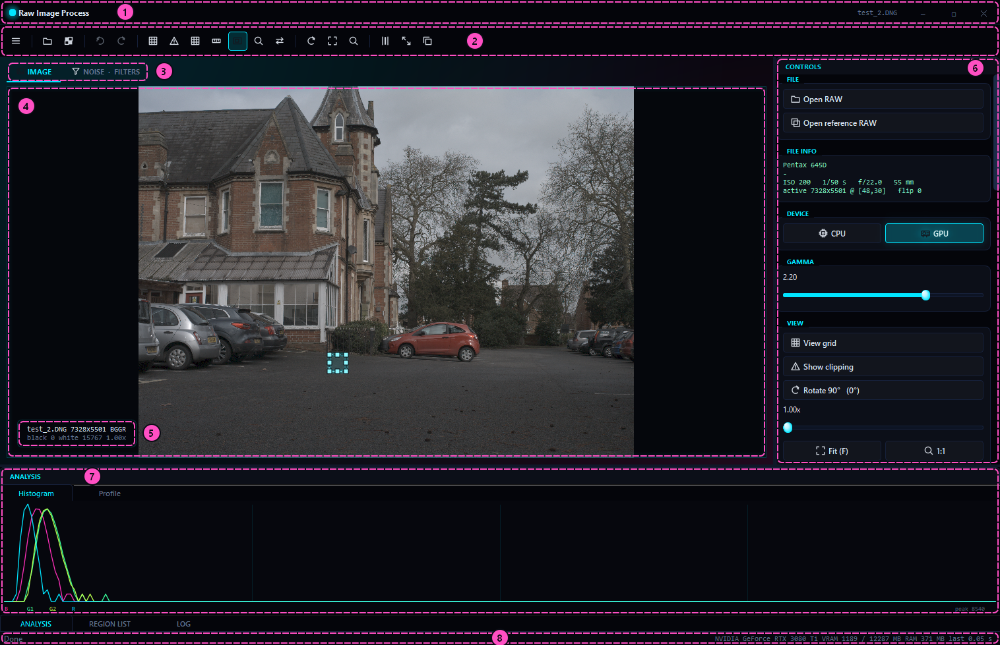

| № | Часть окна | Что делает |
|---|---|---|
| 1 | Заголовок | название программы и открытого файла; кнопки «свернуть», «развернуть», «закрыть». За эту полосу окно перетаскивается |
| 2 | Панель инструментов | кнопка ☰ с главным меню и быстрые кнопки |
| 3 | Вкладки страниц | **IMAGE** — фото, **NOISE · FILTERS** — шум и фильтры. Если открыто несколько файлов, рядом появляются вкладки файлов |
| 4 | Область просмотра | RAW или цветной результат, выделение областей, лупа, сетка, сравнение |
| 5 | HUD | файл, размер, узор CFA; под курсором — координаты, канал и значение; во время обработки — процент выполнения |
| 6 | Панель CONTROLS | кнопки обработки, анализа и экспорта |
| 7 | Нижние панели | ANALYSIS (гистограмма и профиль), REGION LIST, LOG |
| 8 | Строка состояния | данные файла, видеокарта, память, время последней операции, значение под курсором |

Панели CONTROLS, ANALYSIS, REGION LIST и LOG можно перетаскивать за заголовок, складывать вкладками и откреплять в отдельные окна. Расположение запоминается при выходе. <kbd>Tab</kbd> прячет все панели сразу.

### Пустое окно

Пока файл не открыт, в центре подсказка **Drop RAW here**. Перетащи файл из Проводника или нажми <kbd>Ctrl</kbd>+<kbd>O</kbd>.

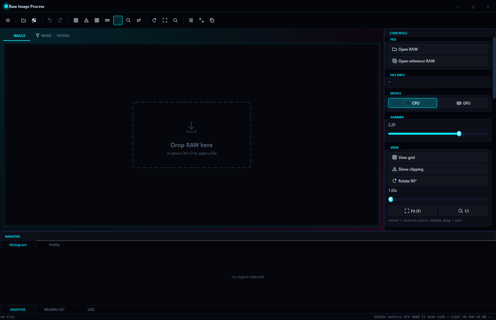

Программа открывает RAW-файлы, которые понимает LibRaw и у которых мозаика Байера: DNG, CR2, CR3, NEF, ARW, ORF, RW2 и другие. Не открываются файлы с сенсором X-Trans (часть камер Fujifilm) и «линейные» DNG, в которых цвет уже восстановлен камерой или телефоном: в них нет мозаики, которую нужно обрабатывать.

### RAW до демозаика

Сразу после открытия показаны исходные значения сенсора: серым, от `black level` (чёрное) до `white level` (белое). Мелкая «клетка» на картинке — это и есть мозаика Байера. Цвета здесь ещё нет, подробнее — в разделе [Восстановление цвета](color.md).

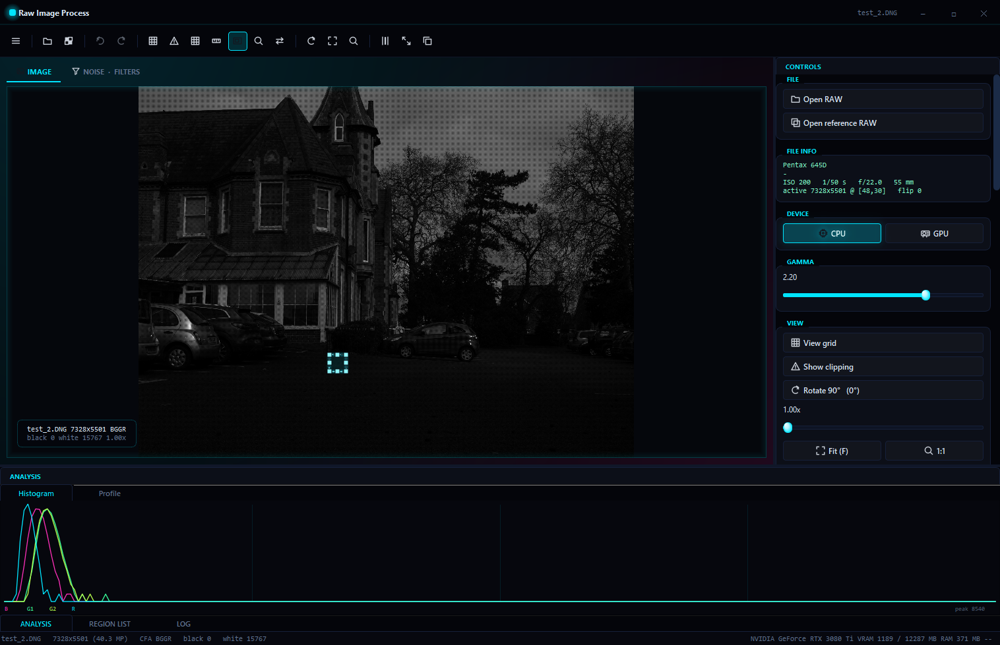

## Главное меню

Кнопка ☰ слева на панели инструментов.

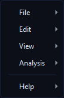

### File

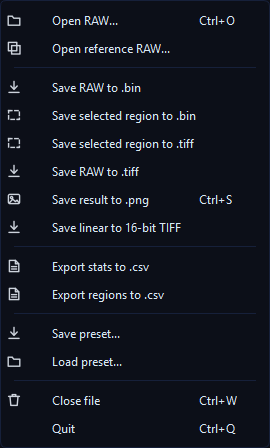

| Пункт | Клавиша | Что делает |
|---|---|---|
| Open RAW... | <kbd>Ctrl</kbd>+<kbd>O</kbd> | открыть RAW; каждый файл открывается в своей вкладке |
| Open reference RAW... | | загрузить второй кадр того же размера — для двухкадрового шума и вычитания темнового кадра |
| Save RAW to .bin | | сохранить значения сенсора как есть, 16 бит без заголовка |
| Save selected region to .bin | | то же, но только выделенная область — так файл читается в Mathcad и MATLAB без зависаний |
| Save selected region to .tiff | | выделенная область как 16-битный серый TIFF без обработки |
| Save RAW to .tiff | | сохранить мозаику как 16-битный серый TIFF |
| Save result to .png | <kbd>Ctrl</kbd>+<kbd>S</kbd> | сохранить цветную картинку после демозаика и гаммы |
| Save linear to 16-bit TIFF | | цвет без гаммы, 16 бит на канал, половинный размер |
| Export stats to .csv | | статистика выделенной области в таблицу |
| Export regions to .csv | | статистика всех областей из REGION LIST |
| Save preset... / Load preset... | | сохранить или загрузить настройки и области в JSON |
| Close file | <kbd>Ctrl</kbd>+<kbd>W</kbd> | закрыть текущий файл |
| Quit | <kbd>Ctrl</kbd>+<kbd>Q</kbd> | выйти |

Форматы файлов подробно разобраны в разделе [Восстановление цвета](color.md#форматы-файлов).

### Edit

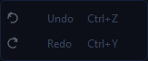

| Пункт | Клавиша | Что делает |
|---|---|---|
| Undo | <kbd>Ctrl</kbd>+<kbd>Z</kbd> | отменить последнее изменение |
| Redo | <kbd>Ctrl</kbd>+<kbd>Y</kbd> | вернуть отменённое |

Отменяются фильтры шума, вычитание темнового кадра, смена black level, возврат к оригиналу, добавление и удаление областей. Хранятся последние 12 шагов. Изменения вида (зум, сетка, поворот) в историю не попадают.

### View

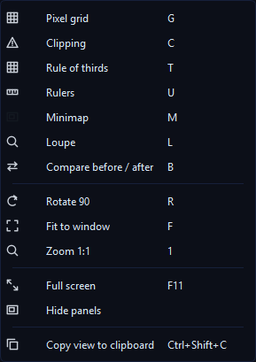

Всё в этом меню меняет только то, как видно изображение. Данные не трогаются.

| Пункт | Клавиша | Что делает |
|---|---|---|
| Pixel grid | <kbd>G</kbd> | сетка между пикселями; видна, когда один пиксель занимает на экране от 4 точек |
| Clipping | <kbd>C</kbd> | красным отмечает пересвет (значение ≥ white level), синим — провал в чёрное (≤ black level) |
| Rule of thirds | <kbd>T</kbd> | линии «правила третей» |
| Rulers | <kbd>U</kbd> | линейки с координатами пикселей сверху и слева |
| Minimap | <kbd>M</kbd> | уменьшенный кадр в углу с рамкой видимой части; появляется при увеличении, включена по умолчанию |
| Loupe | <kbd>L</kbd> | лупа ×8 у курсора с координатами, каналом и значением |
| Compare before / after | <kbd>B</kbd> | слева RAW, справа результат демозаика; разделитель тянется мышью |
| Rotate 90 | <kbd>R</kbd> | повернуть вид на 90°; координаты областей остаются в системе сенсора |
| Fit to window | <kbd>F</kbd> | весь кадр в окне |
| Zoom 1:1 | <kbd>1</kbd> | один пиксель результата на одну точку экрана |
| Full screen | <kbd>F11</kbd> | полный экран |
| Hide panels | <kbd>Tab</kbd> | спрятать панели, панель инструментов и строку состояния |
| Copy view to clipboard | <kbd>Ctrl</kbd>+<kbd>Shift</kbd>+<kbd>C</kbd> | скопировать видимое фото в буфер обмена |

### Analysis

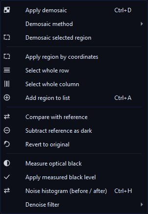

| Пункт | Клавиша | Что делает |
|---|---|---|
| Apply demosaic | <kbd>Ctrl</kbd>+<kbd>D</kbd> | собрать цветную картинку выбранным методом на выбранном устройстве |
| Demosaic method | | подменю: Binning 2x2, Bilinear, Malvar-He-Cutler |
| Demosaic selected region | | демозаик только выделенной области — быстро на больших файлах |
| Apply region by coordinates | | выделить область по полям X, Y, W, H панели CONTROLS |
| Select whole row / Select whole column | | выделить строку номер Y или столбец номер X целиком |
| Add region to list | <kbd>Ctrl</kbd>+<kbd>A</kbd> | добавить текущее выделение в REGION LIST |
| Compare with reference | | двухкадровый шум: временной, фиксированный узор, полный |
| Subtract reference as dark | | вычесть темновой кадр |
| Revert to original | | вернуть кадр в состояние при открытии |
| Measure optical black | | измерить закрытые от света пиксели по краю сенсора |
| Apply measured black level | | заменить black level файла на измеренный |
| Noise histogram (before / after) | <kbd>Ctrl</kbd>+<kbd>H</kbd> | открыть вкладку NOISE · FILTERS |
| Denoise filter | | подменю: Gaussian, Median, Bilateral и Apply current filter (<kbd>Ctrl</kbd>+<kbd>Shift</kbd>+<kbd>D</kbd>) |

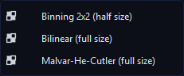

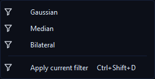

### Help

**About** показывает версию программы, дату сборки, версии Qt, CUDA и LibRaw, название видеокарты.

## Панель инструментов

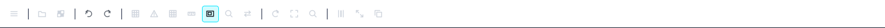

Слева направо:

| Кнопка | Клавиша | Действие |
|---|---|---|
| ☰ | | главное меню |
| Открыть | <kbd>Ctrl</kbd>+<kbd>O</kbd> | Open RAW |
| Мозаика | <kbd>Ctrl</kbd>+<kbd>D</kbd> | Apply demosaic |
| Стрелка назад / вперёд | <kbd>Ctrl</kbd>+<kbd>Z</kbd> / <kbd>Ctrl</kbd>+<kbd>Y</kbd> | Undo / Redo |
| Сетка | <kbd>G</kbd> | Pixel grid |
| Треугольник | <kbd>C</kbd> | Clipping |
| Сетка 3×3 | <kbd>T</kbd> | Rule of thirds |
| Линейка | <kbd>U</kbd> | Rulers |
| Карта | <kbd>M</kbd> | Minimap |
| Лупа | <kbd>L</kbd> | Loupe |
| Две стрелки | <kbd>B</kbd> | Compare before / after |
| Круговая стрелка | <kbd>R</kbd> | Rotate 90 |
| Рамка | <kbd>F</kbd> | Fit to window |
| Лупа 1:1 | <kbd>1</kbd> | Zoom 1:1 |
| Столбцы | | Select whole column |
| Стрелки наружу | <kbd>F11</kbd> | Full screen |
| Два листа | <kbd>Ctrl</kbd>+<kbd>Shift</kbd>+<kbd>C</kbd> | Copy view to clipboard |

Если навести мышь на кнопку, появится её название.

## Работа с изображением

| Действие | Как |
|---|---|
| Увеличить или уменьшить | колесо мыши; увеличивается точка под курсором |
| Сдвинуть кадр | зажать колесо мыши и тянуть |
| Выделить область | левой кнопкой протянуть прямоугольник |
| Изменить размер области | тянуть за маркеры на углах и сторонах рамки |
| Сдвинуть область на 1 пиксель | стрелки; сначала кликни по фото |
| Сдвинуть область на 10 пикселей | <kbd>Shift</kbd>+стрелки |
| Открыть файл | перетащить его в окно |

### Лупа

Лупа (<kbd>L</kbd>) увеличивает участок под курсором в 8 раз. Подпись внизу — координаты пикселя сенсора, его канал и значение в ADU. Те же данные показывает HUD.

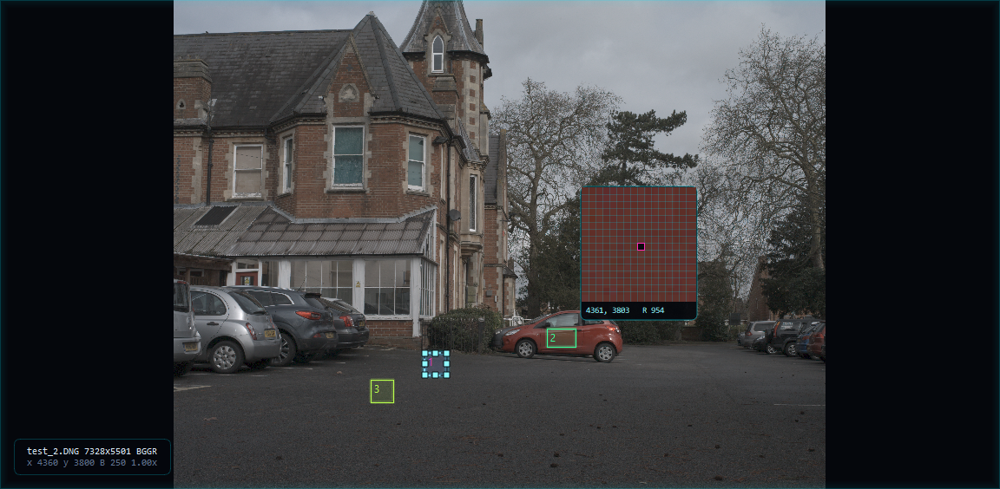

### Сетка пикселей

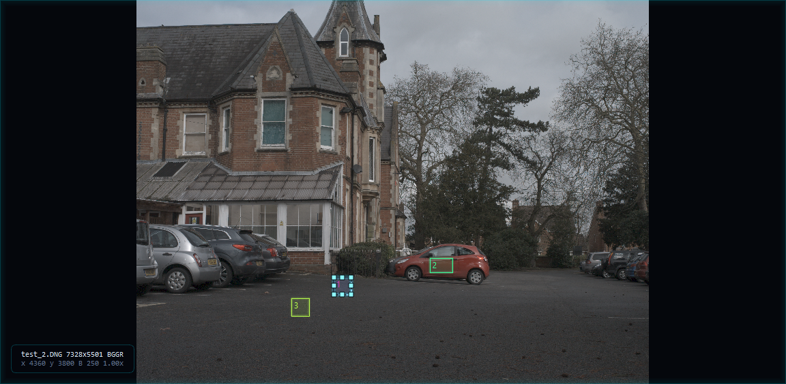

### Линейки и миникарта

При увеличении в углу появляется миникарта: рамка показывает, какая часть кадра сейчас на экране.

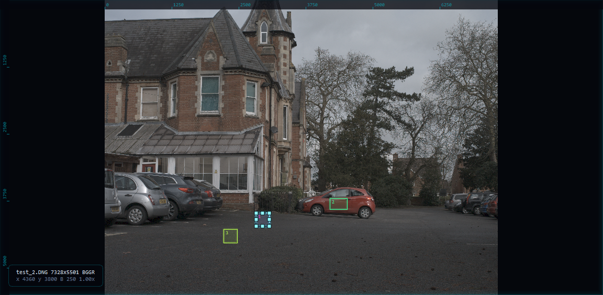

### Клиппинг


### Сравнение RAW и результата

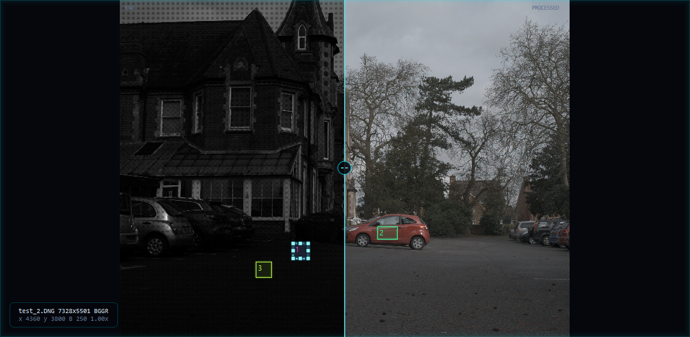

## Панель CONTROLS

Все группы панели сверху вниз. Если панель не помещается по высоте, её можно прокрутить колесом мыши.

### FILE

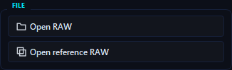

**Open RAW** открывает файл, **Open reference RAW** — второй кадр того же размера для двухкадрового шума и темнового кадра.

### FILE INFO

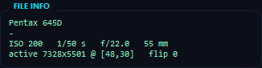

Камера, объектив, ISO, выдержка, диафрагма, фокусное расстояние. Строка `active 7328x5501 @ [48,30]` — размер активной (светочувствительной) области и её смещение от края полного кадра сенсора. `flip` — поворот, записанный камерой; программа сразу применяет его к виду.

### DEVICE

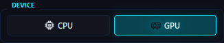

На чём считать демозаик и гамму: **CPU** или **GPU**. Если видеокарты NVIDIA с CUDA нет, кнопка GPU серая и всё считается на процессоре. Фильтры шума и статистика всегда работают на CPU.

### GAMMA

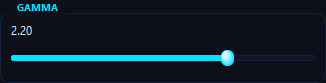

Гамма цветной картинки от 0.10 до 3.00, стандарт — 2.20. Меняет только вид результата демозаика и сохраняемый PNG; RAW-данные и статистику не трогает.

### VIEW

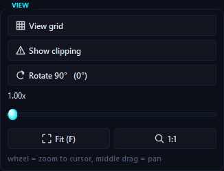

Сетка пикселей, клиппинг, поворот, ползунок зума, кнопки **Fit** и **1:1**. Подсказка внизу напоминает: колесо — зум, средняя кнопка — перемещение.

### PROCESSING

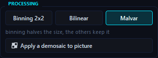

Метод демозаика (**Binning 2x2**, **Bilinear**, **Malvar**) и кнопка **Apply a demosaic to picture**. Во время работы появляются полоса прогресса и кнопка **Cancel**.

### EXPORT RAW

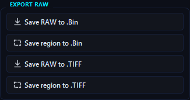

**Save RAW to .Bin** сохраняет весь кадр числами, **Save region to .Bin** — только выделенную область, **Save RAW to .TIFF** — мозаику всего кадра как 16-битный серый TIFF, **Save region to .TIFF** — мозаику выделенной области. Ни один из этих файлов не проходит через демозаик, гамму или фильтры: в них исходные значения сенсора.

Каждое сохранение уходит в **свою папку**, названную по имени файла, — программа создаёт её сама, ничего заранее готовить не нужно. Внутри лежит сам файл и текстовый блокнот с размерами:

- `имя_mathcad.txt` рядом с `.bin` — первой строкой готовая команда `READBIN(...)` для Mathcad, дальше ширина, высота, размер в байтах, уровни black и white, узор CFA и камера;
- `имя_info.txt` рядом с `.tiff` — то же самое без строки `READBIN`, размеры у TIFF есть в заголовке.

Без размеров двоичный файл нельзя прочитать правильно. Подробности — в разделе [Восстановление цвета](color.md#форматы-файлов).

### PROCESSING RESULT

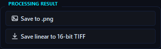

Сохранить цветной результат в PNG или линейный 16-битный TIFF.

### REGION BY MOUSE

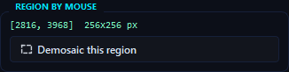

Координаты области, выделенной мышью, и кнопка **Demosaic this region**.

### REGION BY COORDINATES

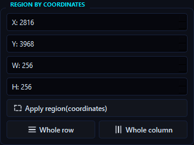

Поля **X**, **Y**, **W**, **H** и кнопка **Apply region(coordinates)** — выделить область точно по числам; вид сразу переходит к ней. **Whole row** выделяет всю строку номер Y, **Whole column** — весь столбец номер X. При выделении мышью поля заполняются сами.

### STATS OF REGION

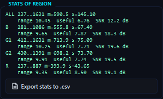

Статистика выделенной области: по две строки на канал.

```text
B   281..1086 m=555.8 s=67.49
    range 9.65  useful 7.87  SNR 18.3 dB
```

| Часть | Значение |
|---|---|
| `B` | канал; первая строка `ALL` — все пиксели вместе |
| `281..1086` | минимум и максимум в ADU |
| `m` | среднее |
| `s` | стандартное отклонение σ; на ровном участке это шум |
| `range` | log₂(max − min + 1): сколько бит занимает разброс значений в области |
| `useful` | log₂((white − black) / σ): сколько уровней различимо над шумом — полезные биты |
| `SNR` | 20·log₁₀((среднее − black) / σ) — отношение сигнал/шум |

Подробно про эти три числа — в разделе [Шум](noise.md#полезные-биты).

Шум читают по строкам каналов, а не по `ALL`. На скриншоте у `ALL` σ = 145.10, а у каналов — от 43.65 до 75.09: при смешивании каналов с разными средними σ завышается.

**Export stats to .csv** сохраняет эти числа вместе с данными файла.

### TWO-FRAME NOISE

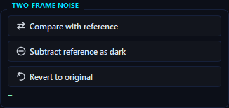

Работает, когда загружен reference RAW:

- **Compare with reference** — шум по двум кадрам: `rd` (временной), `fpn` (фиксированный узор), `tot` (полный) для каждого канала;
- **Subtract reference as dark** — вычесть темновой кадр;
- **Revert to original** — вернуть кадр в состояние при открытии.

Как это считается — в разделе [Шум](noise.md#двухкадровый-метод).

### OPTICAL BLACK

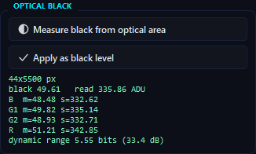

**Measure black from optical area** измеряет закрытые от света пиксели по краю сенсора: среднее (уровень чёрного) и σ (шум считывания), всего и по каналам. Последняя строка — **динамический диапазон сенсора**: log₂((white − black) / σ шума считывания), в битах и в децибелах. **Apply as black level** записывает измеренное среднее в black level файла.

> [!WARNING]
> На скриншоте σ = 335.86 ADU при среднем 49.61. Такой огромный разброс значит, что полоса по краю этого файла не полностью тёмная, и применять это значение нельзя. У честной зоны optical black σ обычно единицы ADU. Если в файле такой зоны нет (например, у DNG с iPhone), программа так и напишет.

### PRESET

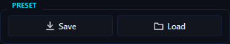

**Save** сохраняет в JSON гамму, устройство, сетку, клиппинг, поворот, зум, список областей и текущее выделение. **Load** возвращает всё обратно. Удобно, когда нужно промерить серию снимков по одним и тем же областям.

## Нижние панели

### ANALYSIS → Histogram

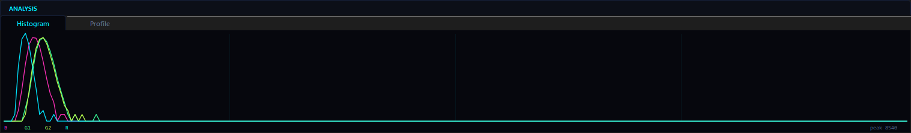

Распределение значений в выделенной области: 256 столбцов от 0 до white level, отдельная цветная кривая для каждого канала. Справа внизу — высота самого высокого столбца (`peak`).

### ANALYSIS → Profile

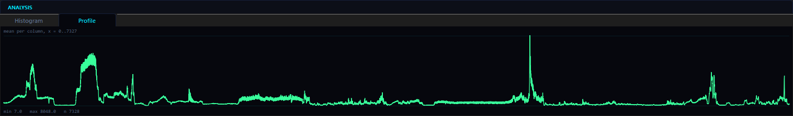

Среднее значение по каждому столбцу области. Если область шириной в один пиксель, — по каждой строке. Удобно искать виньетирование, полосы и перепады освещения. На скриншоте выделена целая строка через машины.

### REGION LIST

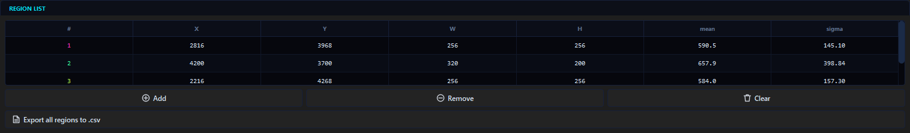

Сохранённые области: номер, X, Y, W, H, среднее и σ.

- Клик по строке выделяет эту область и переносит к ней вид.
- Цвет номера совпадает с цветом рамки на фото.
- **Add** добавляет текущее выделение, **Remove** удаляет выбранную строку, **Clear** очищает список.
- **Export all regions to .csv** сохраняет статистику всех областей по каналам.

### LOG

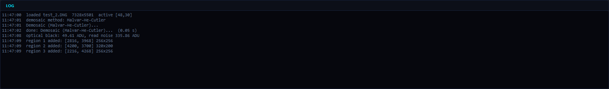

Журнал со временем: какой файл открыт, какие операции выполнены и сколько секунд они заняли, как изменился шум после фильтра.

## Вкладка NOISE · FILTERS

<kbd>Ctrl</kbd>+<kbd>2</kbd> или вкладка над изображением. Здесь сравниваются гистограммы шума до и после обработки и применяются фильтры.

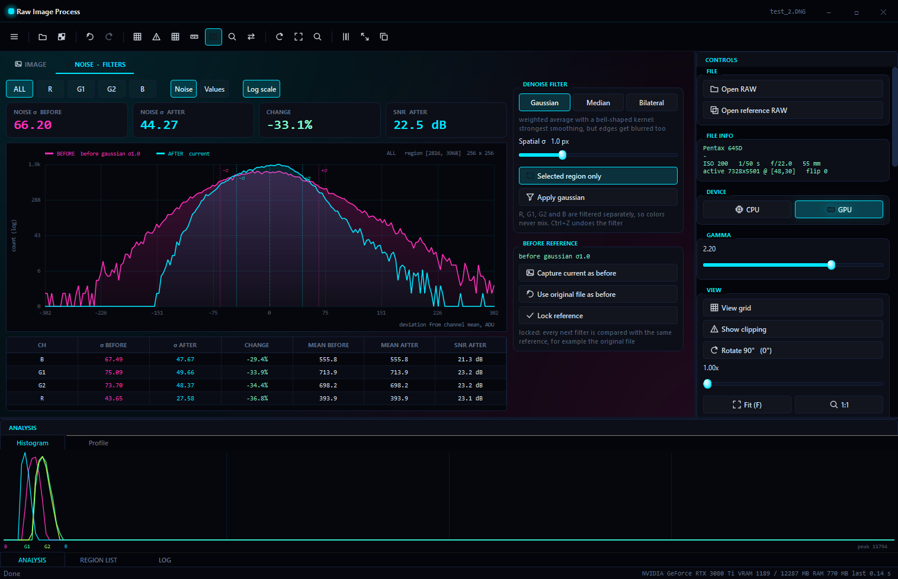

| Элемент | Что делает |
|---|---|
| **ALL / R / G1 / G2 / B** | какой канал показывать; ALL — все четыре вместе |
| **Noise** | гистограмма отклонений от среднего канала — «форма шума» |
| **Values** | гистограмма самих значений |
| **Log scale** | логарифмическая вертикальная шкала, чтобы были видны редкие значения |
| Карточки | σ до, σ после, изменение в процентах, SNR после в dB |
| График | розовая кривая «до», голубая «после»; пунктиры — ±σ |
| Таблица | те же числа по каждому каналу |

Режим **Values** для канала R:

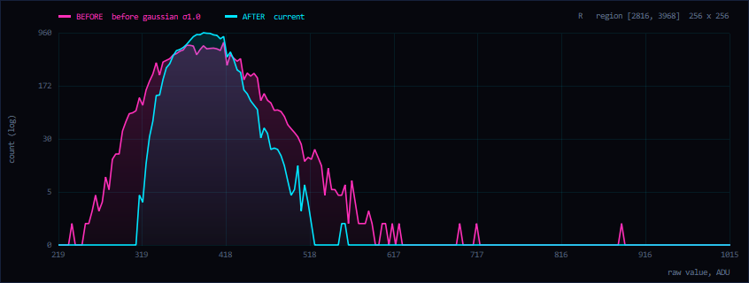

### DENOISE FILTER

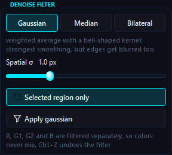

| Элемент | Что делает |
|---|---|
| **Gaussian / Median / Bilateral** | метод фильтра; под кнопками — краткое описание |
| **Spatial σ** | радиус сглаживания в пикселях канала (Gaussian и Bilateral) |
| **Window per channel** | окно медианы 3×3 или 5×5 |
| **Range σ** и **Auto** | насколько разные значения считаются похожими (Bilateral); Auto ставит 2.5 σ шума выделенной области |
| **Selected region only** | фильтровать только выделение; без выделения фильтруется весь кадр |
| **Apply** | применить фильтр; во время работы — прогресс и **Cancel** |

### BEFORE REFERENCE

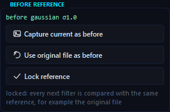

С чем сравнивается «до»:

- **Capture current as before** — запомнить текущее состояние;
- **Use original file as before** — сравнивать с исходным файлом;
- **Lock reference** — не давать фильтрам перезаписывать «до».

Без блокировки перед каждым фильтром «до» запоминается автоматически.

<kbd>Tab</kbd> прячет панели, и график занимает всё окно:

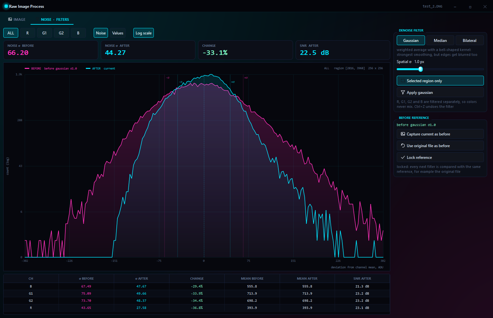

Теория, формулы и проверка фильтров — в разделе [Шум](noise.md).

## Строка состояния

- **Слева:** имя файла, размер в мегапикселях, узор CFA, black и white level, размер reference-кадра.
- **Справа:** название видеокарты или `no CUDA device`, занятая видеопамять, память программы, время последней операции, координаты и значение под курсором.

## Горячие клавиши

| Клавиша | Действие |
|---|---|
| <kbd>Ctrl</kbd>+<kbd>O</kbd> | открыть RAW |
| <kbd>Ctrl</kbd>+<kbd>S</kbd> | сохранить PNG |
| <kbd>Ctrl</kbd>+<kbd>W</kbd> | закрыть файл |
| <kbd>Ctrl</kbd>+<kbd>Q</kbd> | выйти |
| <kbd>Ctrl</kbd>+<kbd>Z</kbd> / <kbd>Ctrl</kbd>+<kbd>Y</kbd> | отменить / вернуть |
| <kbd>Ctrl</kbd>+<kbd>D</kbd> | демозаик |
| <kbd>Ctrl</kbd>+<kbd>A</kbd> | добавить область в список |
| <kbd>Ctrl</kbd>+<kbd>1</kbd> / <kbd>Ctrl</kbd>+<kbd>2</kbd> | вкладка IMAGE / NOISE · FILTERS |
| <kbd>Ctrl</kbd>+<kbd>H</kbd> | вкладка шума |
| <kbd>Ctrl</kbd>+<kbd>Shift</kbd>+<kbd>D</kbd> | применить текущий фильтр шума |
| <kbd>Ctrl</kbd>+<kbd>Shift</kbd>+<kbd>C</kbd> | копировать вид |
| <kbd>G</kbd> <kbd>C</kbd> <kbd>T</kbd> <kbd>U</kbd> <kbd>M</kbd> <kbd>L</kbd> <kbd>B</kbd> | сетка, клиппинг, трети, линейки, миникарта, лупа, сравнение |
| <kbd>R</kbd> / <kbd>F</kbd> / <kbd>1</kbd> | поворот / вписать / 1:1 |
| <kbd>F11</kbd> | полный экран |
| <kbd>Tab</kbd> | спрятать панели |
| стрелки / <kbd>Shift</kbd>+стрелки | сдвинуть область на 1 / 10 пикселей |

## Типичные сценарии

### Шум ровного участка до и после фильтра

1. Открой файл и выдели ровный однотонный участок размером 100–500 пикселей.
2. <kbd>Ctrl</kbd>+<kbd>2</kbd>, режим **Noise**.
3. Выбери фильтр и нажми **Apply**.
4. Посмотри на карточки и таблицу, затем <kbd>Ctrl</kbd>+<kbd>Z</kbd> и попробуй другой фильтр.
5. Чтобы все фильтры сравнивались с исходником: **Use original file as before**, затем **Lock reference**.

### Временной шум и фиксированный узор

1. Сними два одинаковых кадра ровной сцены со штатива с одинаковыми настройками.
2. **Open RAW** — первый кадр, **Open reference RAW** — второй.
3. Выдели ровный участок и нажми **Compare with reference**.

### Убрать горячие пиксели темновым кадром

1. Сними кадр с закрытой крышкой объектива с той же выдержкой, ISO и температурой.
2. Открой обычный кадр, reference — тёмный.
3. **Subtract reference as dark**. <kbd>Ctrl</kbd>+<kbd>Z</kbd> отменит вычитание.

### Серия снимков по одним и тем же областям

1. Выдели области и добавь каждую через <kbd>Ctrl</kbd>+<kbd>A</kbd>.
2. **PRESET → Save**.
3. Открой следующий файл, **PRESET → Load**, затем **Export all regions to .csv**.

### Цветная картинка

1. Выбери метод: **Malvar** — лучшее качество, **Binning** — самый быстрый.
2. <kbd>Ctrl</kbd>+<kbd>D</kbd>, подбери гамму.
3. <kbd>Ctrl</kbd>+<kbd>S</kbd> — PNG, или **Save linear to 16-bit TIFF** для точной обработки в других программах.

### Несколько файлов

Каждый открытый файл получает вкладку над изображением. У каждого файла свои области, гамма, зум и поворот. Крестик на вкладке закрывает файл.
