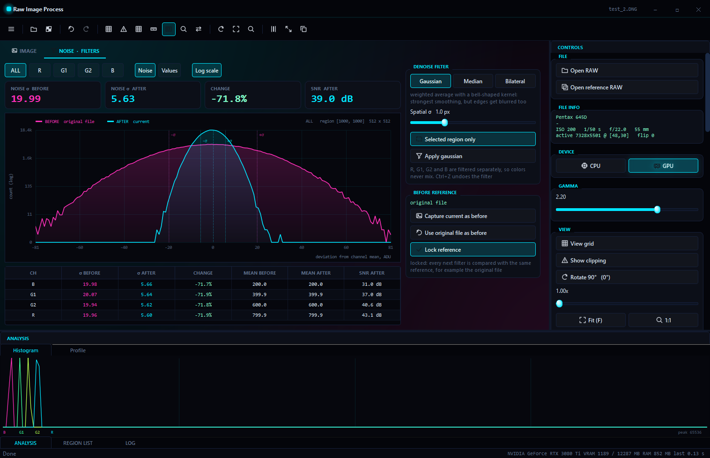

# Шум

Этот раздел объясняет, что такое шум RAW-кадра, как программа его измеряет и как устроены фильтры шумоподавления. Все числа получены на реальных файлах `test.dng` (iPhone 8) и `test_2.DNG` (Pentax 645D) и на синтетическом шуме с известной σ.

## Откуда берётся шум

Даже если снимать идеально ровную серую стену, соседние пиксели покажут разные значения. Основные причины:

| Источник | Откуда | Как себя ведёт |
|---|---|---|
| Фотонный (дробовой) шум | свет приходит отдельными фотонами, их число случайно | σ = √N электронов: растёт с яркостью, но отношение сигнал/шум тоже растёт |
| Шум считывания | усилитель и АЦП сенсора | почти постоянен, заметнее всего в тенях |
| Темновой ток | электроны от нагрева сенсора | растёт с выдержкой и температурой, даёт горячие пиксели |
| Фиксированный узор (FPN) | разная чувствительность отдельных пикселей и столбцов | одинаков от кадра к кадру, поэтому его можно вычесть |
| Квантование | АЦП округляет до целого числа | ±0.5 ADU, важно только при очень малом шуме |

Программа не разделяет все источники поштучно, но даёт инструменты для главных: σ области, двухкадровый метод (случайный шум против фиксированного узора), optical black (уровень чёрного и шум считывания) и темновой кадр.

## Единицы и уровни

- **ADU** — «сырые» единицы сенсора, то число, которое записано в RAW.
- **Black level** — сколько ADU сенсор выдаёт в полной темноте. У `test.dng` — 528, у `test_2.DNG` — 0.
- **White level** — уровень насыщения: всё, что выше, пересвечено. У `test.dng` — 4095 (12 бит), у `test_2.DNG` — 15767.
- **SNR** — отношение сигнал/шум в децибелах:

  ```text
  SNR = 20 · log10( (среднее − black level) / σ )
  ```

  Отношение 10 — это 20 dB, 31.6 — 30 dB, 100 — 40 dB.

## Почему шум считается по каналам

Пиксели под красным, зелёным и синим фильтрами получают разное количество света, и их средние заметно различаются. Если смешать их в одну статистику, σ окажется завышенной: к шуму добавится разница между средними каналов. Поэтому программа всегда считает каналы **R, G1, G2, B** отдельно. Серая плашка из `test.dng`, область 256×256 с угла [3712, 1152]:

| Канал | Среднее, ADU | σ, ADU |
|---|---|---|
| R | 672.3 | 15.17 |
| G1 | 738.1 | 19.96 |
| G2 | 737.7 | 20.35 |
| B | 595.6 | 8.49 |

Насколько сильно смешивание завышает σ, видно на асфальте из `test_2.DNG` (область 256×256 с угла [2816, 3968]). У отдельных каналов σ от 43.65 до 75.09 ADU, а у всех пикселей вместе — 145.10 ADU, потому что средние каналов там сильно различаются: 393.9 у R и 713.9 у G1.

Для **ALL** на вкладке шума берётся объединённая σ без этой ошибки: `√((σR² + σG1² + σG2² + σB²) / 4)`.

## Статистика области

Для каждого канала области программа считает:

```text
среднее  μ = Σ v / N
σ          = √( Σ (v − μ)² / N )
min, max   = наименьшее и наибольшее значение
```

Ещё три числа — `range`, `useful` и `SNR` — описаны ниже, в разделе «Полезные биты».

σ делится на `N`, а не на `N − 1`. На области 256×256 в каждом канале 16 384 пикселя, и разница между этими вариантами меньше 0.01 %.

Статистика считается в два параллельных прохода (функция `compute_region_channels`): первый собирает суммы, минимумы и максимумы, второй — квадраты отклонений от уже известного среднего. Каждый поток копит результат в своих локальных переменных и отдаёт его только в конце, поэтому потоки не мешают друг другу в кэше процессора.

## Полезные биты

Кроме шума в ADU программа показывает три числа, которые переводят шум на язык разрядности. Все они считаются отдельно для каждого канала, для выделенной области.

```text
range  = log2(max − min + 1)
useful = log2((white − black) / σ)
SNR    = 20 · log10((среднее − black) / σ)
```

| Число | Что означает |
|---|---|
| **range bits** | сколько бит занимает разброс значений в области. На ровном участке это разброс самого шума, на пёстром — разброс сюжета |
| **useful bits** | сколько уровней различимо над шумом: полный диапазон сенсора делится на σ. Это и есть «полезные биты» |
| **SNR** | отношение сигнал/шум в децибелах; 6.02 dB — это ровно один бит |

Раньше программа показывала только `log2(max − min)`, то есть размах значений. Это число не говорит ничего о качестве: на шумном участке оно большое именно из-за шума. Полезные биты устроены иначе — чем меньше шум, тем их больше.

**Пример.** Сенсор Pentax 645D: black 0, white 15767, то есть полный диапазон 15767 ADU. На асфальте σ канала B равна 67.49 ADU:

```text
useful = log2(15767 / 67.49) = log2(233.6) = 7.87 бита
```

Из 14 бит АЦП на этом участке реально различимы примерно 8. Остальное съедено шумом и фактурой асфальта.

**Связь с ENOB.** В технике АЦП принято считать эквивалентное число разрядов с поправкой на шум квантования: `ENOB = log2(FS / (σ · √12)) = useful − 1.79`. Программа показывает `useful`, вычесть 1.79 при необходимости просто.

**Что портит результат.** σ должна быть шумом, а не сюжетом. На текстуре полезные биты получаются заниженными. Поэтому меряй на ровном однотонном участке, как описано ниже.

**Динамический диапазон всего сенсора** считается по шуму считывания: выполни **Measure black from optical area**, и программа покажет `log2((white − black) / σ)` по закрытой зоне. Это верхняя граница: лучше этого числа от камеры не получить.

## Как правильно мерить шум

1. **Ровный однотонный объект**: серая карта, лист бумаги, ровное небо. На текстуре (асфальт, ткань) в σ попадает сама текстура.
2. **Без пересвета**: максимум области должен быть ниже white level. Проверь режимом **Clipping** (<kbd>C</kbd>).
3. **Размер 100×100 … 500×500**: меньше — числа скачут, больше — попадает неравномерность освещения и виньетирование.
4. **Проверка**: профиль области почти ровный, а гистограмма **Values** для каждого канала — один узкий колокол.

Серая плашка `test.dng` даёт σ 8–20 ADU, асфальт в `test_2.DNG` — 44–75 ADU: к шуму там добавилась фактура асфальта.

## Гистограмма и профиль

**Histogram** (панель ANALYSIS) делит диапазон 0…white level на 256 столбцов и считает, сколько пикселей каждого канала попало в каждый столбец. **Profile** показывает среднее по каждому столбцу области, а для области шириной в один пиксель — по каждой строке.

## Гистограммы до и после


### Режим Noise

Для каждого пикселя считается отклонение от среднего его канала: `v − μ`. Это «форма шума» без учёта уровня яркости.

- **Диапазон** — ±4σ самого шумного канала снимка «до».
- **Ширина столбца** — целое число ADU (1, 2, 3…). Значения RAW целые, и при дробной ширине одни столбцы получали бы одно значение, а другие два. Гистограмма превращалась бы в «гребёнку».
- **«До» и «после» строятся на одинаковых столбцах**, поэтому кривые можно сравнивать напрямую.
- **Пунктиры ±σ**: розовые — «до», голубые — «после». Чем ближе голубые к центру, тем меньше шум.

### Режим Values

Гистограмма самих значений в диапазоне среднее ± 4σ. Видно, где лежит каждый канал и насколько сузился его колокол.


### С чем сравнивается «до»

- **По умолчанию** «до» — исходный файл.
- **Перед каждым фильтром**, темновым кадром или сменой black level текущее состояние запоминается как «до» автоматически.
- **Capture current as before** запоминает вручную.
- **Use original file as before** возвращает сравнение с исходником.
- **Lock reference** запрещает перезапись. Так цепочка из нескольких фильтров сравнивается с одним и тем же исходником.

«До» хранится как полная копия кадра. Поэтому при смене выделенной области гистограмма «до» пересчитывается для той же области.

## Двухкадровый метод

Нужны два снимка одной и той же ровной сцены с одинаковыми настройками, лучше со штатива. Фиксированный узор одинаков на обоих кадрах, а случайный шум разный. Если вычесть кадры, узор исчезнет, а случайный шум останется.

```text
D   = A − B                      разность кадров, пиксель за пикселем
rd  = √( Var(D) / 2 )            временной (случайный) шум одного кадра
tot = √( Var(A) )                полный шум кадра A
fpn = √( max(0, Var(A) − Var(D)/2) )   фиксированный узор
```

Деление на 2 нужно потому, что при вычитании двух независимых кадров их случайные дисперсии складываются: `Var(D) = 2 · rd²`. Полный шум складывается из случайного и постоянного: `tot² = rd² + fpn²`. Всё считается по каналам R, G1, G2, B внутри выделенной области или по всему кадру.

**Как читать результат.** Если `fpn` мал по сравнению с `rd`, шум почти целиком случайный, и его снижают усреднением кадров и фильтрами. Если `fpn` велик, помогут темновой кадр или калибровка плоским полем.

## Темновой кадр

Кадр, снятый с закрытой крышкой объектива с той же выдержкой, ISO и температурой, содержит темновой ток, горячие пиксели и узор. Программа вычитает его из обычного кадра:

```text
результат = кадр − тёмный кадр + black level      (обрезается в 0…white level)
```

Black level добавляется обратно, потому что тёмный кадр сам содержит black level. Иначе результат ушёл бы ниже нуля.

> [!NOTE]
> Случайный шум тёмного кадра при вычитании добавляется к шуму результата. Если шумы кадров одинаковы, случайная часть вырастет в √2 раза. Поэтому в астро- и научной съёмке вычитают среднее из нескольких тёмных кадров. Программа вычитает один кадр.

## Optical black

У многих камер по краю сенсора есть полоса пикселей, закрытых от света. Программа ищет её слева от активной области (если отступ не меньше 6 пикселей), иначе сверху. Среднее этой зоны — реальный уровень чёрного, а σ — шум считывания.


У `test_2.DNG` найдена полоса 44×5500 пикселей: среднее 49.61 ADU, но σ = 335.86 ADU. Настоящая закрытая зона даёт σ в единицы ADU, так что эта полоса светится, и применять её как black level нельзя. У `test.dng` (iPhone 8) такой зоны нет.

**Apply as black level** записывает округлённое среднее в black level кадра. Это отменяется через <kbd>Ctrl</kbd>+<kbd>Z</kbd>.

## Фильтры шумоподавления

### Общая схема

Все три фильтра работают по одной последовательности (функция `denoise_frame`):

1. **Область с запасом.** К выделенной области добавляется поле `2·(r + 1)` пикселей (r — радиус фильтра), чтобы на границе выделения не было ступеньки. Начало выравнивается на чётные координаты, чтобы не сбить узор Байера.
2. **Разделение на каналы.** Область раскладывается на 4 плоскости половинного размера — R, G1, G2 и B. Цвета не смешиваются.
3. **Фильтр каждой плоскости.** Строки делятся между потоками. За краем плоскости подставляется ближайший крайний пиксель (структура `PlaneIndex`).
4. **Возврат в кадр.** Отфильтрованные значения записываются только внутрь выделения и округляются до целых ADU.
5. **Прогресс и отмена.** Главный поток раз в 2 мс обновляет процент. Если нажать **Cancel**, кадр остаётся без изменений.

> [!IMPORTANT]
> Spatial σ задаётся в пикселях **плоскости канала**. Соседние пиксели одного цвета на сенсоре стоят через один, поэтому 1 пиксель плоскости = 2 пикселя сенсора.

### Gaussian

Взвешенное среднее соседей с весами в форме «колокола»:

```text
w(i) = exp( −i² / (2σ²) ) / Σ exp(...)      i = −r … r,  r = ⌈3σ⌉
```

Фильтр **разделимый**: сначала проход по строкам, затем по столбцам. Для σ = 1 это 7 + 7 умножений на пиксель вместо 49 для окна 7×7, а результат тот же.

**Чего ждать.** Для некоррелированного шума двумерный гауссов фильтр уменьшает σ в `2σ√π` раз. При σ = 1 это в 3.54 раза: шум 20 ADU должен стать 5.64 ADU. Края тоже размываются.

### Median

Значения окна 3×3 (9 пикселей) или 5×5 (25 пикселей) частично упорядочиваются, и берётся средний по порядку элемент. Это делает `std::nth_element` за линейное время, без полной сортировки.

**Чего ждать.** Для гауссова шума медиана из n значений даёт σ примерно в `√(π / 2n)` от исходной: 0.418 для 3×3 и 0.251 для 5×5. Медиана устойчива к выбросам, поэтому лучше всех убирает горячие пиксели и одиночные точки, а резкие края сохраняет.

### Bilateral

Как гауссов фильтр, но вес соседа зависит ещё и от того, насколько его значение похоже на центральное:

```text
w = exp( −(dx² + dy²) / (2σs²) ) · exp( −(v_сосед − v_центр)² / (2σr²) )
r = ⌈2σs⌉
```

- **σs** (Spatial σ) — насколько далеко смотреть.
- **σr** (Range σ) — какая разница значений ещё считается «тем же объектом».
- **Сосед на другой стороне края** отличается сильно, получает почти нулевой вес и не размывает край.

Веса по расстоянию и таблица весов по разнице значений (до 6σr) считаются заранее, поэтому в цикле нет вызовов `exp`.

**Как выбрать σr.** Примерно 2–3 σ шума ровного участка; кнопка **Auto** ставит 2.5 σ. Если σr слишком велик, фильтр работает как обычный Gaussian и размывает края. Если слишком мал, он почти ничего не делает.

### Проверка на синтетическом шуме

Кадр 1001×801 с уровнями каналов 1000 / 2000 / 3000 / 4000 ADU и гауссовым шумом σ = 20 ADU. Фильтр применён ко всему кадру.

| Фильтр | σ после | Теория | Средние каналов |
|---|---|---|---|
| Gaussian σ 1.0 | 5.68 | 5.64 | без изменений |
| Median 3×3 | 8.17 | 8.36 | без изменений |
| Median 5×5 | 4.99 | 5.02 | без изменений |
| Bilateral σs 1.0, σr 40 | 8.51 | — | без изменений |

Дополнительно проверено:
- в режиме «только область» пиксели за её пределами не меняются;
- после отмены кадр остаётся прежним;
- область у самого края кадра обрабатывается без ошибок.

Через интерфейс программы тот же тест даёт σ 19.99 → 5.63 для Gaussian σ 1.0:



### На реальных кадрах

Gaussian σ 1.0, область 256×256 (`docs/examples/noise_report.cpp`):

| Канал | `test.dng`, серая плашка | `test_2.DNG`, асфальт |
|---|---|---|
| R | 15.17 → 12.26 (−19.2 %) | 43.65 → 27.58 (−36.8 %) |
| G1 | 19.96 → 17.18 (−13.9 %) | 75.09 → 49.66 (−33.9 %) |
| G2 | 20.35 → 17.79 (−12.5 %) | 73.70 → 48.37 (−34.4 %) |
| B | 8.49 → 6.00 (−29.4 %) | 67.49 → 47.67 (−29.4 %) |

На реальных снимках эффект заметно слабее, чем на синтетике, и это ожидаемо:
- **iPhone** сохраняет в DNG уже частично обработанный сигнал; шум соседних пикселей связан между собой, и усреднение помогает хуже;
- **на асфальте** в σ входит фактура поверхности, которую фильтр не должен и не может убрать.

### Скорость

Весь кадр 4032×3024, Release-сборка, AMD Ryzen 5 7500F (12 потоков):

| Фильтр | Время |
|---|---|
| Gaussian σ 1.0 | 156 мс |
| Median 3×3 | 185 мс |
| Median 5×5 | 413 мс |
| Bilateral σs 1.0 | 167 мс |

В Debug-сборке те же фильтры работают в 3.4–6.2 раза медленнее.

### Какой фильтр выбрать

| Задача | Фильтр |
|---|---|
| Максимально снизить σ на ровном участке | Gaussian σ 1–2 |
| Убрать горячие пиксели и одиночные выбросы | Median 3×3 |
| Сильнее убрать шум и сохранить края объектов | Bilateral, Range σ через Auto |
| Сохранить мелкие детали | Median 3×3 или Bilateral с небольшим Range σ |
